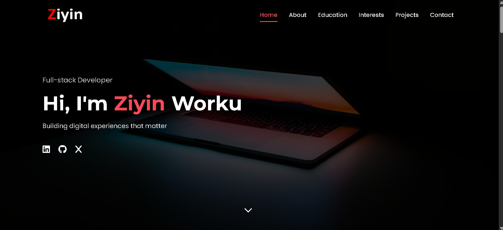

# Ziyin Worku - Full-Stack Developer Portfolio



A modern, responsive portfolio website showcasing my skills, projects, and professional journey as a full-stack developer.

## Features

✨ **Modern Design**: Clean, professional layout with smooth animations  
📱 **Fully Responsive**: Works on all device sizes  
🎨 **CSS Animations**: Engaging hover effects and transitions  
📊 **Interactive Elements**: Skill bars, project cards, and more  
📝 **Contact Form**: Easy way to get in touch  
⚡ **Performance Optimized**: Fast loading with no JavaScript  

## Technologies Used

- **HTML5**: Semantic markup for accessibility
- **CSS3**: Modern styling with Flexbox and Grid
- **Font Awesome**: Icon library
- **Google Fonts**: Typography
- **Netlify**: Hosting and form handling

## Sections

1. **Home**: Hero section with introduction
2. **About**: Professional summary and stats
3. **Education & Skills**: Timeline and skill visualization
4. **Interests**: My professional passions
5. **Projects**: Portfolio showcase with live demos
6. **Contact**: Get in touch form and information

## Projects Showcased

- Netflix Clone (React + TMDB API)
- Amazon Clone (Firebase + Express + React)
- Evangadi Forum (React + Express + MySQL)
- Portfolio Website (HTML/CSS/javascript)


## Installation

No installation required! Simply visit the live site:

🔗 [Live Demo](https://ziyintech.com)  
🔗 [GitHub Repository](https://github.com/ziyin-worku/July2025Cohort-Hackathon1)

## How to Run Locally

1. Clone the repository:
   ```bash
   git clone https://github.com/ziyin-worku/my-portfolio.git
2. Open index.html in your browser